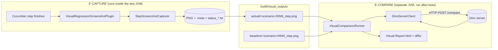
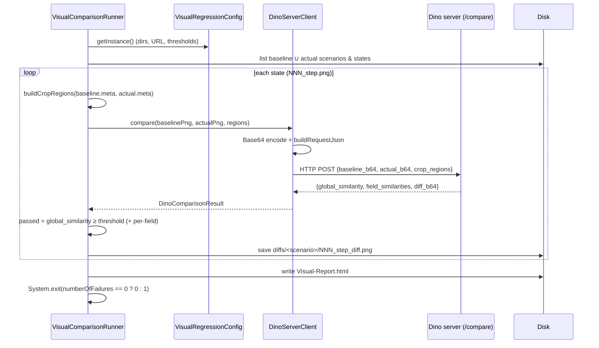

# Visual Comparison — Architecture & Flow

How per-step screenshots are captured during a Cucumber run and then compared against approved
baselines with the DINOv2 (“Dino”) server to produce a visual-regression report.

- **Repo root:** `D:\RDF_POS_Test\MobilePOSAutomationTests-UIComparison\Mobile-UIComparison`
- **Module:** `MobilePOSUITests`
- **Package:** [`com.enactor.pos.mobile.visual`](MobilePOSUITests/src/com/enactor/pos/mobile/visual/)
- **Dino server (external):** `D:\MPOC\DINOv2\dino_server.py` (FastAPI, `POST /compare`)

---

## 1. The big picture

The feature is split into **two independent subsystems that never call each other in code** — they
meet only on disk. This is the single most important design fact.



**Why decoupled?**

- The **capture** side must live inside the test JVM (it needs the live Appium driver) and is bound
  to Appium **java-client v7.5.1**.
- The **compare** side is pure JDK (HTTP + Base64 + image files) and could even run on another
  machine. Keeping it out of the test JVM means no extra dependencies and no Appium-version coupling.
- The contract between them is a **directory layout** (see §5), not a Java interface.

---

## 2. Component catalog

### Capture side (produces screenshots)

| Class / file | Responsibility |
|---|---|
| [VisualRegressionScreenshotPlugin.java](MobilePOSUITests/src/com/enactor/pos/mobile/visual/VisualRegressionScreenshotPlugin.java) | Cucumber `ConcurrentEventListener`. Listens to the Cucumber event bus and fires a capture after every real Gherkin step. **The trigger.** |
| [VisualRegressionDriverRegistry.java](MobilePOSUITests/src/com/enactor/pos/mobile/visual/VisualRegressionDriverRegistry.java) | `ThreadLocal<WebDriver>` holder — the one seam that hands the live Appium session to the plugin, decoupled from the controllers. |
| [StepScreenshotCapturer.java](MobilePOSUITests/src/com/enactor/pos/mobile/visual/StepScreenshotCapturer.java) | Takes the screenshot, writes the PNG, the `.meta` bounding boxes, and the per-scenario `status_*.txt`. |
| [VisualStateNamingStrategy.java](MobilePOSUITests/src/com/enactor/pos/mobile/visual/VisualStateNamingStrategy.java) | Turns a scenario name → safe folder name and a step → ordered `NNN_step.png` file name. |
| Controllers (seam) | Publish the freshly-created driver into the registry (one added line each — see §4). |

### Compare side (consumes screenshots)

| Class / file | Responsibility |
|---|---|
| [VisualComparisonRunner.java](MobilePOSUITests/src/com/enactor/pos/mobile/visual/VisualComparisonRunner.java) | `main()` entry point. Walks baseline vs actual, calls the server per state, writes the HTML report + diff PNGs. **The orchestrator.** |
| [DinoServerClient.java](MobilePOSUITests/src/com/enactor/pos/mobile/visual/DinoServerClient.java) | JDK-only HTTP client: Base64-encodes the image pair, POSTs to `/compare`, parses the response. |
| [CropRegion.java](MobilePOSUITests/src/com/enactor/pos/mobile/visual/CropRegion.java) | One tracked field’s baseline + actual bounding box + threshold; serialises to the server’s `crop_regions` schema. |
| [DinoComparisonResult.java](MobilePOSUITests/src/com/enactor/pos/mobile/visual/DinoComparisonResult.java) | Parsed response (`global_similarity`, `field_similarities`, `diff_b64`). |
| [JsonUtil.java](MobilePOSUITests/src/com/enactor/pos/mobile/visual/JsonUtil.java) | Tiny dependency-free JSON escape/extract helpers (no Gson/Jackson). |

### Shared

| Class / file | Responsibility |
|---|---|
| [VisualRegressionConfig.java](MobilePOSUITests/src/com/enactor/pos/mobile/visual/VisualRegressionConfig.java) | Single source of truth. Loads [`automation-test-config.properties`](MobilePOSUITests/test/automation-test-config.properties). Read by **both** sides. |

### Launchers

| Script | Purpose |
|---|---|
| [run-tests.ps1](run-tests.ps1) | Runs the Cucumber suite; `-VisualRegression` adds the capture plugin. |
| [run-visual-compare.ps1](run-visual-compare.ps1) | `-Promote` approves a run as baseline; default runs the comparison + report. |

---

## 3. CAPTURE — how a screenshot is triggered on every Cucumber step

### 3.1 Activation (how the plugin gets loaded)

The plugin is enabled purely by **configuration** — no step-definition or runner code changes.

1. [run-tests.ps1](run-tests.ps1#L28-L31) builds the plugin list and, with `-VisualRegression`,
   passes it to Maven:
   ```
   -Dcucumber.plugin=pretty,com.enactor.pos.mobile.visual.VisualRegressionScreenshotPlugin
   ```
2. The TestNG runner [RunCucumberTests.java](CoreAutomationNR/src/com/enactor/core/automation/cucumber/RunCucumberTests.java#L80-L105)
   forwards all test parameters/system properties into Cucumber options, so `cucumber.plugin` is honored.
3. Cucumber instantiates the plugin via its no-arg constructor
   ([VisualRegressionScreenshotPlugin:47](MobilePOSUITests/src/com/enactor/pos/mobile/visual/VisualRegressionScreenshotPlugin.java#L47))
   and calls
   [`setEventPublisher()`](MobilePOSUITests/src/com/enactor/pos/mobile/visual/VisualRegressionScreenshotPlugin.java#L57-L62),
   which subscribes to three lifecycle events: `TestCaseStarted`, `TestStepFinished`, `TestCaseFinished`.

### 3.2 The driver seam (how the plugin reaches the live session)

The plugin needs the running Appium driver but must not be coupled to the controllers. So each
controller, immediately after creating its driver, **publishes** it into a `ThreadLocal` registry:

```java
driver = createDriver(url, capabilities);
// Visual-regression instrumentation (additive, behaviour-neutral):
com.enactor.pos.mobile.visual.VisualRegressionDriverRegistry.register(driver);
```

Added in three controllers (the driver families actually used):

- Thin-client — [MobileTestController.java:186](MobilePOSUITests/src/com/enactor/pos/mobile/MobileTestController.java#L186)
- React thick — [web/MobileThickReactController.java:161](MobilePOSUITests/src/com/enactor/pos/mobile/web/MobileThickReactController.java#L161)
- React thin — [web/MobileThinClientReactController.java:73](MobilePOSUITests/src/com/enactor/pos/mobile/web/MobileThinClientReactController.java#L73)

The registry stores it as the common super-type `org.openqa.selenium.WebDriver`
([VisualRegressionDriverRegistry:24](MobilePOSUITests/src/com/enactor/pos/mobile/visual/VisualRegressionDriverRegistry.java#L24))
so a single seam serves every driver family (`AppiumDriver<MobileElement>` and `AppiumDriver<WebElement>` alike).

### 3.3 Per-step capture flow (method by method)

```mermaid
sequenceDiagram
    participant CU as Cucumber engine
    participant PL as VisualRegressionScreenshotPlugin
    participant RG as VisualRegressionDriverRegistry
    participant CP as StepScreenshotCapturer
    participant NM as VisualStateNamingStrategy
    participant DR as Appium driver
    participant FS as Disk

    CU->>PL: TestCaseStarted
    Note over PL: onTestCaseStarted()<br/>store scenario name, reset step counter (=0)

    loop every Gherkin step
      CU->>PL: TestStepFinished
      Note over PL: onTestStepFinished()
      PL->>PL: enabled? & is PickleStepTestStep? (skip hooks)
      PL->>RG: getActiveDriver()
      RG-->>PL: WebDriver (or null → skip)
      PL->>PL: index = counter+1 ; buildStepLabel(keyword+text)
      PL->>CP: capture(driver, scenario, index, label)
      CP->>NM: scenarioFolderName() / stateFileName()
      CP->>DR: getScreenshotAs(FILE)  (TakesScreenshot)
      CP->>DR: findElements(By.id) + getRect()  (crop fields, if configured)
      CP->>FS: write NNN_step.png + NNN_step.meta
    end

    CU->>PL: TestCaseFinished
    Note over PL: onTestCaseFinished()
    PL->>CP: writeScenarioStatus(scenario, passed)
    CP->>FS: status_passed.txt | status_failed.txt
    PL->>PL: clear ThreadLocals
```

**The exact call chain:**

1. **Scenario starts** → [`onTestCaseStarted()`](MobilePOSUITests/src/com/enactor/pos/mobile/visual/VisualRegressionScreenshotPlugin.java#L64-L67)
   stores the scenario name and resets the step counter (both `ThreadLocal`, so parallel-safe).
2. **Each step finishes** → [`onTestStepFinished()`](MobilePOSUITests/src/com/enactor/pos/mobile/visual/VisualRegressionScreenshotPlugin.java#L69-L91):
   - returns early if `VisualRegression.Enabled=false`;
   - **skips Cucumber before/after hooks** — captures only real `PickleStepTestStep` steps;
   - pulls the driver from [`VisualRegressionDriverRegistry.getActiveDriver()`](MobilePOSUITests/src/com/enactor/pos/mobile/visual/VisualRegressionDriverRegistry.java#L47-L49) (null → skip, e.g. before the app launches);
   - increments the 1-based step index and builds the label from the step keyword + text
     ([`buildStepLabel()`](MobilePOSUITests/src/com/enactor/pos/mobile/visual/VisualRegressionScreenshotPlugin.java#L106-L111));
   - calls [`StepScreenshotCapturer.capture(...)`](MobilePOSUITests/src/com/enactor/pos/mobile/visual/StepScreenshotCapturer.java#L75-L101).
3. **Inside `capture()`** ([StepScreenshotCapturer:75](MobilePOSUITests/src/com/enactor/pos/mobile/visual/StepScreenshotCapturer.java#L75-L101)):
   - resolves the scenario folder ([`scenarioDirectory()`](MobilePOSUITests/src/com/enactor/pos/mobile/visual/StepScreenshotCapturer.java#L119-L123)) and the ordered file name ([`VisualStateNamingStrategy.stateFileName()`](MobilePOSUITests/src/com/enactor/pos/mobile/visual/VisualStateNamingStrategy.java#L48-L54));
   - extracts bounding boxes for any configured crop fields ([`extractFieldMetadata()`](MobilePOSUITests/src/com/enactor/pos/mobile/visual/StepScreenshotCapturer.java#L129-L141) via `By.id` + `getRect()`);
   - takes the picture with `((TakesScreenshot) driver).getScreenshotAs(FILE)` and copies it to `NNN_step.png`;
   - writes the sibling `NNN_step.meta` (a `Properties` file of `field.x/y/width/height`).
4. **Scenario finishes** → [`onTestCaseFinished()`](MobilePOSUITests/src/com/enactor/pos/mobile/visual/VisualRegressionScreenshotPlugin.java#L93-L104)
   writes `status_passed.txt` or `status_failed.txt`
   ([`writeScenarioStatus()`](MobilePOSUITests/src/com/enactor/pos/mobile/visual/StepScreenshotCapturer.java#L109-L117))
   and clears the ThreadLocals.

> **Fail-safe guarantee:** every capture operation is wrapped in try/catch
> ([StepScreenshotCapturer:96](MobilePOSUITests/src/com/enactor/pos/mobile/visual/StepScreenshotCapturer.java#L96)) and the
> registry never throws — a screenshot problem can **never** fail the functional test.

> **What “step timeout” means here:** there is no per-step Cucumber timeout. A step only “finishes”
> (and thus is captured) once the controller’s `FluentWait`/`implicitlyWait` resolves. Raising
> `-DwaitingTimeOut=…` lengthens that wait.

---

## 4. On-disk contract (the interface between the two halves)

Both sides agree on this layout. Roots are configurable (§6); scenario/file naming is produced by
[VisualStateNamingStrategy](MobilePOSUITests/src/com/enactor/pos/mobile/visual/VisualStateNamingStrategy.java)
and re-read verbatim by the runner.

```
MobilePOSUITests/build/visual_outputs/
├── actual/                         ← written by CAPTURE (this run)
│   └── <ScenarioName>/
│       ├── 001_Given_user_signs_on_as_Sales_Assistant_.png
│       ├── 001_Given_user_signs_on_as_Sales_Assistant_.meta
│       ├── 002_When_user_enters_Product_1_into_Input_Box_field.png
│       ├── ...
│       └── status_passed.txt | status_failed.txt
└── baseline/                       ← approved copy (via run-visual-compare.ps1 -Promote)
    └── <ScenarioName>/
        └── 001_..._.png (+ .meta)
```

- **Scenario → folder:** sanitised `[^a-zA-Z0-9.-] → _`.
- **Step → file:** zero-padded `NNN_` prefix so alphabetical sort = execution order.
- **`.meta`:** `Properties` of `<field>.x/.y/.width/.height` per tracked crop field (empty when none configured).

---

## 5. COMPARE — how baselines are compared and the report is built

Run **after** a test run, with the Dino server up. Entry point:
[`VisualComparisonRunner.main()`](MobilePOSUITests/src/com/enactor/pos/mobile/visual/VisualComparisonRunner.java#L55-L59).



**The exact call chain:**

1. [`run()`](MobilePOSUITests/src/com/enactor/pos/mobile/visual/VisualComparisonRunner.java#L68-L107)
   resolves baseline/actual/report dirs from config, verifies the baseline dir exists, then iterates
   the **union** of scenario and state names across baseline and actual
   ([`sortedScenarioNames()`](MobilePOSUITests/src/com/enactor/pos/mobile/visual/VisualComparisonRunner.java) /
   `sortedStateFiles()`), so a state present on only one side is reported (`Missing`) rather than dropped.
2. For each state, [`compareState()`](MobilePOSUITests/src/com/enactor/pos/mobile/visual/VisualComparisonRunner.java#L110):
   - [`buildCropRegions()`](MobilePOSUITests/src/com/enactor/pos/mobile/visual/VisualComparisonRunner.java) reads both `.meta`
     files and emits a [`CropRegion`](MobilePOSUITests/src/com/enactor/pos/mobile/visual/CropRegion.java) per field that has a
     non-empty box in **both** images (threshold from [`config.getFieldThreshold()`](MobilePOSUITests/src/com/enactor/pos/mobile/visual/VisualRegressionConfig.java));
   - calls [`DinoServerClient.compare()`](MobilePOSUITests/src/com/enactor/pos/mobile/visual/DinoServerClient.java#L46) which
     Base64-encodes both PNGs, hand-builds the JSON body, `POST`s via `HttpURLConnection`, and parses the
     response with [`DinoComparisonResult.fromJson()`](MobilePOSUITests/src/com/enactor/pos/mobile/visual/DinoComparisonResult.java#L33);
   - a state **passes** when `global_similarity ≥ VisualRegression.SimilarityThreshold` and every tracked
     field clears its own threshold;
   - saves the server’s diff heat-map to `diffs/<scenario>/<state>_diff.png` (`saveDiffImage()`).
3. [`writeHtmlReport()`](MobilePOSUITests/src/com/enactor/pos/mobile/visual/VisualComparisonRunner.java#L250)
   groups states by scenario and renders collapsible `<details>` sections (auto-expanded when a scenario
   has an unmatched step). Each step row shows the step name with its **Matched/Unmatched** badge and
   similarity score beneath it, the baseline + actual thumbnails, and a diff image **only** when the
   step is unmatched.
4. `main()` exits non-zero when any state failed, so CI can gate on visual regressions.

### The Dino `/compare` contract (`D:\MPOC\DINOv2\dino_server.py`)

```jsonc
// REQUEST
{ "baseline_b64": "<base64 PNG>", "actual_b64": "<base64 PNG>",
  "crop_regions": [ { "name", "base_x","base_y","base_width","base_height",
                      "actual_x","actual_y","actual_width","actual_height", "threshold" } ] }
// RESPONSE
{ "global_similarity": 0.0-1.0,
  "field_similarities": { "<name>": 0.0-1.0 },
  "field_structural_scores": {…}, "field_color_scores": {…},
  "diff_b64": "<base64 PNG heat-map>" }
```

The server embeds DINOv2 (`facebook/dinov2-with-registers-large`): it resizes both images to 518×518,
extracts patch tokens, and scores structural similarity via cosine similarity of patches (plus a colour
check for crop fields). Tracked-field patches are excluded from the global score so field changes don’t
double-count.

---

## 6. Configuration reference

All keys live in [`MobilePOSUITests/test/automation-test-config.properties`](MobilePOSUITests/test/automation-test-config.properties)
and are read by [VisualRegressionConfig](MobilePOSUITests/src/com/enactor/pos/mobile/visual/VisualRegressionConfig.java).
Resolution order: working directory first, then class-path.

| Key | Default | Used by | Meaning |
|---|---|---|---|
| `VisualRegression.Enabled` | `true` | capture | Master on/off for per-step capture. |
| `VisualRegression.OutputDir` | `build/visual_outputs/actual` | both | Root for captured actual images. |
| `VisualRegression.BaselineDir` | `build/visual_outputs/baseline` | compare | Root for approved baselines. **Must match `$baselineDir` in run-visual-compare.ps1.** |
| `VisualRegression.ReportDir` | `build/reports/visual-regression` | compare | Where HTML report + diffs are written. |
| `VisualRegression.DinoServerUrl` | `http://localhost:8000/compare` | compare | The `/compare` endpoint. |
| `VisualRegression.SimilarityThreshold` | `0.95` | compare | Min `global_similarity` to be **Matched**. |
| `VisualRegression.FieldSimilarityThreshold` | `0.80` | compare | Default per-field pass threshold. |
| `VisualRegression.FieldThreshold.<name>` | — | compare | Per-field override. |
| `VisualRegression.CropFields` | *(empty)* | capture | Comma-separated field names to track. |
| `VisualRegression.CropField.<name>` | — | capture | Appium resource-id for each tracked field. |

> ⚠️ **Keep `BaselineDir` (config) and `$baselineDir` (run-visual-compare.ps1) pointing at the same
> folder** — a mismatch is the classic “Baseline directory not found” error.

---

## 7. End-to-end run sequence

```powershell
# 0. Start the Dino server (from D:\MPOC\DINOv2) on the port in DinoServerUrl.
uvicorn dino_server:app --host 0.0.0.0 --port 8000

# 1. Capture a known-good run and approve it as the baseline.
.\run-tests.ps1 -VisualRegression
.\run-visual-compare.ps1 -Promote

# 2. On later runs: capture again, then compare and open the report.
.\run-tests.ps1 -VisualRegression
.\run-visual-compare.ps1 -Open
```

Report: `MobilePOSUITests/build/reports/visual-regression/Visual-Report.html`.

> **Appium note (unrelated to screenshots):** start Appium with `--allow-insecure=adb_shell` so the
> framework’s printer-peripheral calls don’t 500.

---

## 8. Design principles & guarantees

- **Additive, behaviour-neutral.** The only edits to existing code are three one-line driver
  registrations. Everything else is new files activated by config.
- **Fail-safe capture.** Capture never throws into the test; the registry is best-effort.
- **Parallel-safe.** Per-scenario state is `ThreadLocal`; the registry is `ThreadLocal`.
- **No new dependencies.** Both halves use only the JDK + APIs already present (Selenium/Appium 7,
  Cucumber `ConcurrentEventListener`, `HttpURLConnection`, `Base64`).
- **Disk is the contract.** Capture and compare share property keys and a directory layout, never a
  compile-time dependency — so the comparison can run in any JVM, any time, even remotely.

### Extension points

- **Track UI fields:** set `CropFields` + `CropField.<name>` → the capturer records boxes and the
  runner sends `crop_regions`, adding per-field scores to the report.
- **Different server / thresholds:** change the config keys — no code change.
- **CI gate:** the runner’s non-zero exit code already flags any regression.

---

## 9. Method quick-reference

| Trigger / step | File · method |
|---|---|
| Plugin activated | [run-tests.ps1 §L28-L31](run-tests.ps1#L28-L31) → `-Dcucumber.plugin=…` |
| Runner forwards options | [RunCucumberTests.getAdditionalOptions()](CoreAutomationNR/src/com/enactor/core/automation/cucumber/RunCucumberTests.java#L80-L105) |
| Subscribe to events | [VisualRegressionScreenshotPlugin.setEventPublisher()](MobilePOSUITests/src/com/enactor/pos/mobile/visual/VisualRegressionScreenshotPlugin.java#L57-L62) |
| Driver published | [MobileTestController:186](MobilePOSUITests/src/com/enactor/pos/mobile/MobileTestController.java#L186), [MobileThickReactController:161](MobilePOSUITests/src/com/enactor/pos/mobile/web/MobileThickReactController.java#L161), [MobileThinClientReactController:73](MobilePOSUITests/src/com/enactor/pos/mobile/web/MobileThinClientReactController.java#L73) |
| Scenario start | [plugin.onTestCaseStarted()](MobilePOSUITests/src/com/enactor/pos/mobile/visual/VisualRegressionScreenshotPlugin.java#L64-L67) |
| **Each step → capture** | [plugin.onTestStepFinished()](MobilePOSUITests/src/com/enactor/pos/mobile/visual/VisualRegressionScreenshotPlugin.java#L69-L91) → [capturer.capture()](MobilePOSUITests/src/com/enactor/pos/mobile/visual/StepScreenshotCapturer.java#L75-L101) |
| Scenario end → status | [plugin.onTestCaseFinished()](MobilePOSUITests/src/com/enactor/pos/mobile/visual/VisualRegressionScreenshotPlugin.java#L93-L104) → [capturer.writeScenarioStatus()](MobilePOSUITests/src/com/enactor/pos/mobile/visual/StepScreenshotCapturer.java#L109-L117) |
| Comparison entry | [VisualComparisonRunner.main()](MobilePOSUITests/src/com/enactor/pos/mobile/visual/VisualComparisonRunner.java#L55-L59) → [run()](MobilePOSUITests/src/com/enactor/pos/mobile/visual/VisualComparisonRunner.java#L68-L107) |
| Per-state compare | [runner.compareState()](MobilePOSUITests/src/com/enactor/pos/mobile/visual/VisualComparisonRunner.java#L110) → [DinoServerClient.compare()](MobilePOSUITests/src/com/enactor/pos/mobile/visual/DinoServerClient.java#L46) |
| Parse response | [DinoComparisonResult.fromJson()](MobilePOSUITests/src/com/enactor/pos/mobile/visual/DinoComparisonResult.java#L33) |
| Build report | [runner.writeHtmlReport()](MobilePOSUITests/src/com/enactor/pos/mobile/visual/VisualComparisonRunner.java#L250) |
